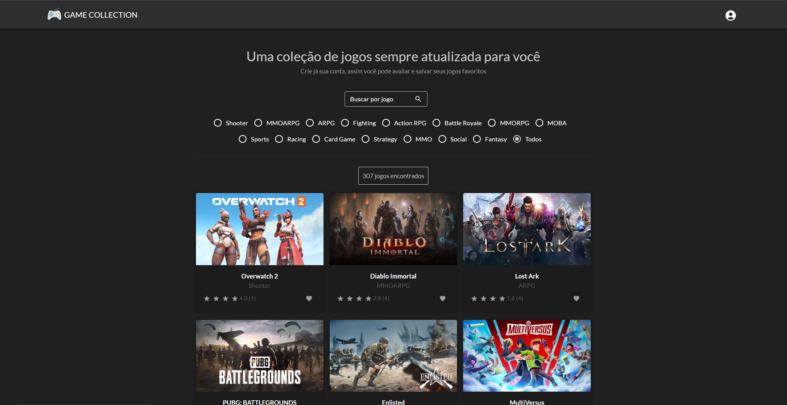
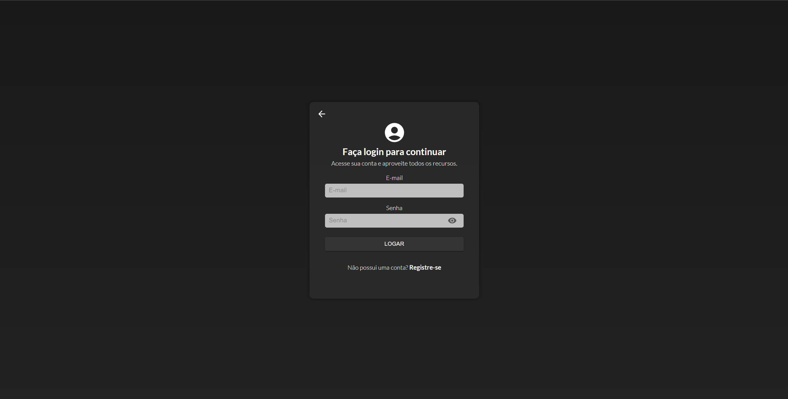
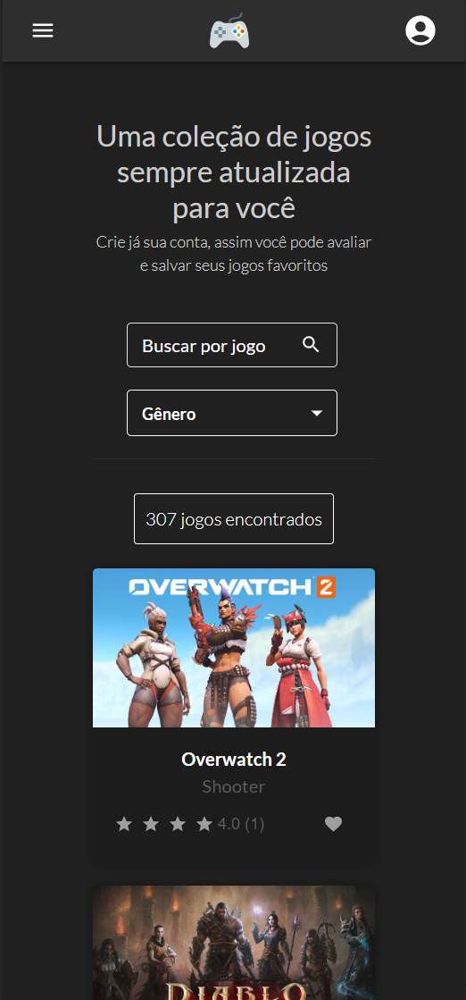

# Game Collection - React/TypeScript/MUI5

## Web page

Essa é a página inicial da aplicação, onde contém o campo de pesquisa,  o filtro por gênero, o ícone para realizar a autenticação e os cards contendo os ícones de avaliação (com as notas já avaliadas por outros usuários) e o ícone para favoritar um jogo. Neste caso, a página exibida é de quando o usuário não está logado, ao logar são exibidos os filtros como jogos favoritos do usuário e ordenação por avaliação.

## Auth page
     

Essa é a página de autenticação via firebase, com um visual compacto e responsivo, que alterna entre login e cadastro se mantendo na mesma rota.

## Mobile page

Essa é a página mobile da aplicação, com um visual mais compacto contendo as mesmas funções da página Web, com algumas mudanças no visual do filtro de gênero e com a adição de um menu lateral.

